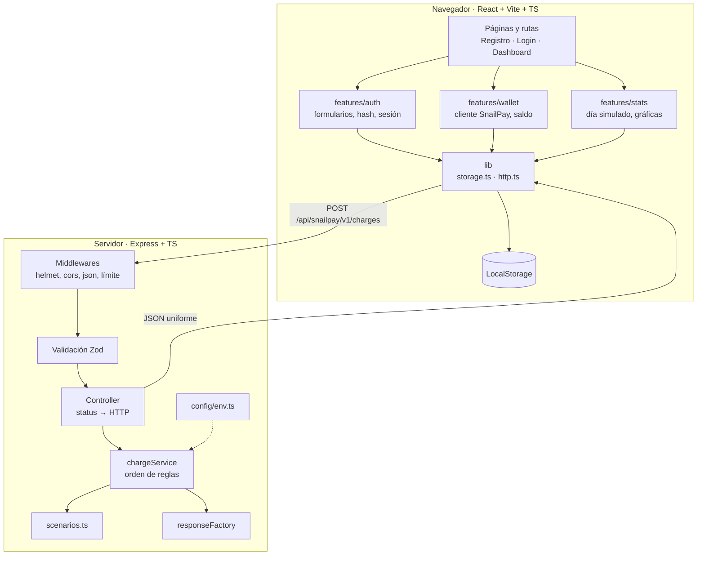
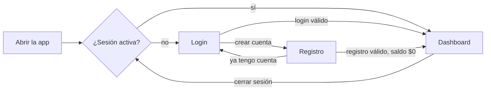
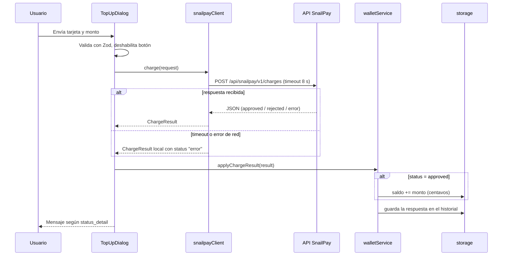

# Arquitectura de SnailRacer

**Resumen:** el navegador guarda todos los datos del usuario en LocalStorage; Express solo decide si un cobro de SnailPay se aprueba o no. El backend no tiene estado, lo que simplifica pruebas y despliegue.

## 1. Vista general



## 2. Estructura de carpetas

```text
snailracer/
├── apps/
│   ├── web/                              # React + Vite + TS
│   │   ├── src/
│   │   │   ├── app/                      # App.tsx, router.tsx, providers.tsx
│   │   │   ├── pages/                    # RegisterPage, LoginPage, DashboardPage, NotFoundPage
│   │   │   ├── features/
│   │   │   │   ├── auth/
│   │   │   │   │   ├── components/       # RegisterForm, LoginForm
│   │   │   │   │   ├── AuthContext.tsx   # estado de sesión + acciones
│   │   │   │   │   ├── authContextValue.ts # contexto y tipos (separado por fast refresh)
│   │   │   │   │   ├── useAuth.ts        # hook de acceso al contexto
│   │   │   │   │   ├── authService.ts    # register, login, logout (lógica pura)
│   │   │   │   │   ├── password.ts       # hashPassword, verifyPassword (PBKDF2)
│   │   │   │   │   ├── schemas.ts        # Zod de registro y login
│   │   │   │   │   ├── ProtectedRoute.tsx
│   │   │   │   │   └── PublicOnlyRoute.tsx
│   │   │   │   ├── wallet/
│   │   │   │   │   ├── components/       # BalanceCard, TopUpDialog, TopUpForm, ChargeHistory
│   │   │   │   │   ├── snailpayClient.ts # fetch con timeout (AbortController)
│   │   │   │   │   ├── walletService.ts  # applyChargeResult: suma solo si approved
│   │   │   │   │   ├── statusMessages.ts # status_detail → mensaje en español
│   │   │   │   │   └── useTopUp.ts       # estado del flujo de recarga
│   │   │   │   └── stats/
│   │   │   │       ├── components/       # BetsDonutChart, SnailWinsBarChart, RaceResultsList
│   │   │   │       ├── mockRaceDay.ts    # generador determinista del día
│   │   │   │       └── snails.ts         # catálogo de 6 caracoles
│   │   │   ├── components/ui/            # Button, Input, Card, Dialog, Toast (base shadcn/ui)
│   │   │   ├── lib/                      # storage.ts, http.ts, prng.ts, money.ts
│   │   │   ├── styles/index.css          # Tailwind + tokens de diseño
│   │   │   ├── assets/                   # snailracer-logo.svg
│   │   │   └── main.tsx
│   │   ├── tests/                        # pruebas de componentes y servicios
│   │   ├── vite.config.ts                # proxy /api → backend en desarrollo
│   │   └── .env.example
│   └── api/                              # Express + TS
│       ├── src/
│       │   ├── app.ts                    # crea la app (sin listen) → testeable
│       │   ├── server.ts                 # solo listen
│       │   ├── config/env.ts             # variables de entorno validadas con Zod
│       │   ├── routes/snailpay.routes.ts
│       │   ├── controllers/charges.controller.ts
│       │   ├── services/snailpay/
│       │   │   ├── chargeService.ts      # orden de evaluación de reglas
│       │   │   ├── scenarios.ts          # tarjetas de prueba y su resultado
│       │   │   └── responseFactory.ts    # construye la respuesta uniforme
│       │   ├── middlewares/              # validate, errorHandler, notFound
│       │   └── schemas/charge.schema.ts
│       ├── tests/charges.test.ts
│       └── .env.example
├── packages/shared/                      # tipos del contrato SnailPay (request/response)
├── docs/
│   ├── architecture.md                   # este archivo
│   ├── snailpay-api.md                   # contrato del API
│   ├── styles.md                         # guía de estilos
│   └── design/                           # referencia visual de las pantallas
├── CONTEXT.md
├── README.md                             # instalación, ejecución, pruebas, tarjetas de prueba
├── package.json                          # workspaces + scripts raíz
└── .nvmrc
```

### Paquete compartido

`@snailracer/shared` se compila con `tsc` a `dist/` (Node no ejecuta `.ts` desde dependencias en producción). Los scripts raíz `dev`, `build`, `test` y `typecheck` lo compilan primero; en `dev` queda en modo watch junto a web y api.

## 3. Responsabilidades por capa

### Frontend

| Capa                     | Responsabilidad                                                     | No hace                            |
| ------------------------ | ------------------------------------------------------------------- | ---------------------------------- |
| `pages/`                 | Componer la pantalla con componentes de features                    | Lógica de negocio                  |
| `features/*/components`  | Pintar UI y capturar eventos                                        | Leer LocalStorage o llamar `fetch` |
| `features/*/*Service.ts` | Reglas de negocio puras (registro, login, aplicar cobro)            | Renderizar                         |
| `AuthContext` / hooks    | Conectar servicios con React (estado, efectos)                      | Reglas de negocio propias          |
| `lib/storage.ts`         | Único acceso a LocalStorage, validación con Zod, claves versionadas | Conocer componentes                |
| `lib/http.ts`            | `fetch` con timeout, parseo y errores tipados                       | Decidir mensajes al usuario        |

### Backend

| Capa                   | Responsabilidad                                                                                                                          |
| ---------------------- | ---------------------------------------------------------------------------------------------------------------------------------------- |
| `middlewares`          | Seguridad básica (helmet, cors con origen explícito), JSON con límite de tamaño, manejo central de errores                               |
| `schemas` + `validate` | Validar el body con Zod; si falla → 400 `invalid_request` con la lista de campos                                                         |
| `controller`           | Traducir el resultado del servicio a código HTTP; no conoce los escenarios                                                               |
| `chargeService`        | Aplicar las reglas en orden y nunca aprobar de más                                                                                       |
| `scenarios.ts`         | Tabla de tarjetas de prueba → resultado (agregar un escenario = una línea)                                                               |
| `responseFactory`      | Construir la respuesta con los 11 campos, siempre con la misma forma                                                                     |
| `config/env.ts`        | Leer y validar variables de entorno (`PORT`, `CORS_ORIGIN`, `SNAILPAY_SIMULATE_OUTAGE`, `SNAILPAY_SLOW_DELAY_MS`, `SNAILPAY_MAX_AMOUNT`) |

Rutas desconocidas del API responden `404 { "error": "not_found" }`; JSON malformado `400 { "error": "invalid_json" }`; body > 10 KB `413 { "error": "payload_too_large" }`. Las rutas de SnailPay usan siempre la forma del contrato.

## 4. Rutas y pantallas

| Ruta         | Acceso                              | Pantalla                                                     |
| ------------ | ----------------------------------- | ------------------------------------------------------------ |
| `/`          | —                                   | Redirige a `/dashboard` si hay sesión, si no a `/login`      |
| `/registro`  | Solo sin sesión (`PublicOnlyRoute`) | Formulario de registro                                       |
| `/login`     | Solo sin sesión (`PublicOnlyRoute`) | Formulario de inicio de sesión                               |
| `/dashboard` | Solo con sesión (`ProtectedRoute`)  | Saldo, gráficas, historial, botón de recarga y cerrar sesión |
| `*`          | —                                   | 404 con enlace de regreso                                    |

La recarga es un **modal** dentro del dashboard, no una ruta.

### Flujo de sesión



- Tras registrarse se inicia sesión automáticamente.
- Sesión expirada o datos corruptos → se limpia la sesión y se envía a `/login` con un aviso.

### Flujo de recarga



## 5. Modelo de datos en LocalStorage

Todas las claves llevan prefijo y versión (`snailracer:v1:`) para poder migrar el esquema.

| Clave                            | Contenido                   | Notas                                           |
| -------------------------------- | --------------------------- | ----------------------------------------------- |
| `snailracer:v1:users`            | `Record<email, StoredUser>` | Correo normalizado (trim + minúsculas)          |
| `snailracer:v1:session`          | `Session`                   | Sin datos sensibles; expira a las 24 h          |
| `snailracer:v1:wallet:{userId}`  | `{ balanceCents: number }`  | Arranca en 0                                    |
| `snailracer:v1:charges:{userId}` | `ChargeResponse[]`          | Respuestas de SnailPay, la más reciente primero |

```ts
// Tipos de referencia (no son código final)
interface StoredUser {
  id: string; // crypto.randomUUID()
  fullName: string;
  email: string; // normalizado
  passwordHash: string; // base64
  salt: string; // base64, 16 bytes aleatorios
  iterations: number; // 600_000
  createdAt: string; // ISO 8601
}

interface Session {
  userId: string;
  createdAt: string;
  expiresAt: string;
}
```

### Contraseña

- Algoritmo: PBKDF2-SHA256 con `crypto.subtle`, sal aleatoria de 16 bytes, 600,000 iteraciones.
- Login: se recalcula el hash con la sal guardada y se compara.
- Error genérico: "Correo o contraseña incorrectos" (no revela si el correo existe).
- `crypto.subtle` solo existe en contextos seguros (HTTPS o `localhost`). Abrir la app por IP de red (`http://192.168…`) rompe el registro; para probar en móvil usa el modo responsive del navegador o un túnel HTTPS.
- Las iteraciones se pasan como parámetro para que las pruebas usen menos; el valor real se guarda por usuario.

### Limitaciones conocidas (aceptadas por ser simulación)

- Cualquier script del mismo origen puede leer LocalStorage (riesgo ante XSS).
- El usuario puede editar su saldo desde las DevTools.
- Guardar número completo de tarjeta y CVV contradice PCI DSS; se hace solo porque los datos son ficticios. En un sistema real se guardaría únicamente un token o los últimos 4 dígitos, y nunca el CVV.
- En producción, autenticación y saldo vivirían en el servidor (argon2/bcrypt, cookie `httpOnly`, transacciones en base de datos).

## 6. Datos simulados del dashboard

Una función pura genera el día completo y de ella salen ambas gráficas:

```ts
generateRaceDay(seed: string): RaceDay
// seed = fecha local AAAA-MM-DD → mismos datos al recargar la página
```

- PRNG con semilla (mulberry32), nunca `Math.random`.
- 6 caracoles fijos en `snails.ts`; 6 carreras con un ganador cada una.
- 1 a 3 apuestas simuladas por carrera; ganada si el caracol apostado ganó esa carrera.

**Invariantes (probadas):**

1. La suma de victorias es exactamente 6.
2. Ganadas + perdidas = total de apuestas.
3. Misma semilla → mismo resultado.

## 7. Manejo de errores

| Situación                 | Dónde se detecta        | Resultado para el usuario                                             | ¿Cambia el saldo? |
| ------------------------- | ----------------------- | --------------------------------------------------------------------- | ----------------- |
| Formulario inválido       | Zod en el cliente       | Error por campo, no se envía                                          | No                |
| 400 `invalid_request`     | API                     | Mensaje con los campos a corregir                                     | No                |
| 402 `rejected`            | API                     | Motivo traducido de `status_detail`                                   | No                |
| 503 `service_unavailable` | API                     | "El servicio de pagos no está disponible. No se aplicó ningún cargo." | No                |
| Timeout (8 s)             | `snailpayClient`        | "La operación tardó demasiado. No se aplicó ningún cargo."            | No                |
| Error de red              | `snailpayClient`        | "No pudimos conectar con el servicio de pagos."                       | No                |
| Respuesta malformada      | Zod en `snailpayClient` | Mensaje genérico de error                                             | No                |
| LocalStorage corrupto     | `storage.ts`            | Se limpia la sesión, se envía a login                                 | No                |

## 8. Despliegue (opcional)

Un solo proceso: Express sirve el build estático de React y el API bajo `/api`. Una sola URL, sin CORS, un Dockerfile multi-etapa:

1. Etapa `build-web`: compila `apps/web`.
2. Etapa `build-api`: compila `apps/api`.
3. Imagen final con Node que copia ambos builds y ejecuta `server.js`.

HTTPS es obligatorio en la práctica porque `crypto.subtle` no funciona en HTTP.
